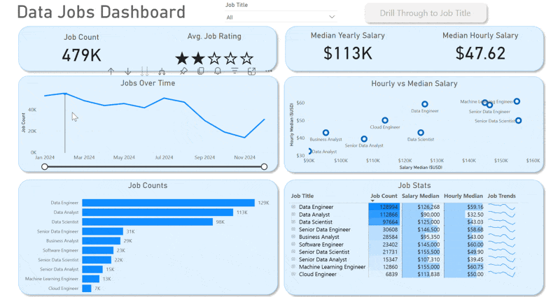

# First Project

## Introduction

I built this dashboard to showcase my skills in data analysis and visualization by exploring the 2024 data science job market. Using a real dataset of job postings (including titles, salaries, and locations), I cleaned, transformed, and visualized the data to highlight key trends and insights. The goal was not just to solve the challenge of scattered information, but also to demonstrate my ability to turn raw data into an intuitive, decision-friendly tools.

## Dashboard File

You can find the file for the dashboard here: [`Power_Bi_First_Project.pbix`](Power_Bi_First_Project.pbix).

## Skills Demonstrated  

- ⚙️ **Power Query (ETL):** Data cleaning & transformation  
- 🧮 **DAX Measures:** KPIs like Median Salary & Job Count  
- 📊 **Visuals:** Column, Bar, Line, Area Charts  
- 🗺️ **Maps:** Job distribution by location  
- 🔢 **KPIs & Tables:** Quick metrics & detailed data  
- 🎨 **Design:** Clear and interactive dashboard layout  
- 🖱️ **Interactivity:** Slicers, Bookmarks, Drill-Through  

## Dashboard Overview

*This report is split into two distinct pages to provide both a high-level summary and a detailed analysis.*

### Page 1: High-Level Market View

  

This is your mission control for the data job market. It showcases key KPIs like total job count, median salaries, and top job titles to give you a quick understanding of what's happening in the job market at a glance.

### Page 2: Job Title Drill Through

  

This is the deep-dive page. From the main dashboard, you can drill through to this view to get specific details for a single job title, including salary ranges, work-from-home stats, top hiring platforms, and a global map of job locations.

## Conclusion  

This project reflects my ability to collect, clean, and analyze real-world data, then translate it into clear and interactive insights using Power BI. It’s not only a showcase of technical skills, but also of my focus on building tools that make data easier to understand and act upon.  
