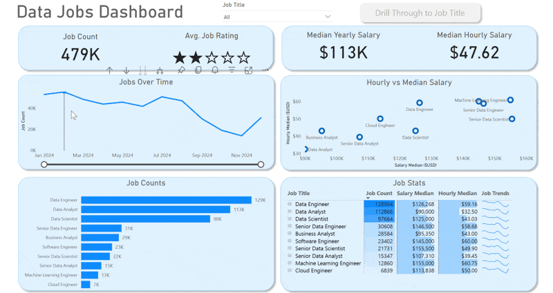

# 📊 Data Jobs Dashboards Portfolio  

This repository showcases two Power BI projects I built to practice and demonstrate my **data analysis** and **visualization skills**.  
Both dashboards explore the **2024 data science job market**, highlighting trends, salaries, and in-demand skills using a real-world dataset of job postings.  

---

## 🚀 Projects Included  

### 1️⃣ First Project – Data Jobs Dashboard (Two Pages)  

  

**Overview:**  
This first project introduces a two-page dashboard:  
- **Page 1:** High-level market view with KPIs (Job Count, Median Salaries, Top Job Titles).  
- **Page 2:** Drill-through analysis for a single job title, including salary ranges, remote work stats, hiring platforms, and global job locations.  

**File:** [`Power_Bi_First_Project.pbix`](Project_1/Data_Jobs_Dashboard.pbix)  

**Skills Demonstrated:**  
- ⚙️ Power Query (ETL) – Cleaning & transforming raw data  
- 🧮 DAX Measures – Creating KPIs like Median Salary & Job Count  
- 📊 Visualizations – Column, Bar, Line, Area charts  
- 🗺️ Maps – Job distribution by location  
- 🔢 KPIs & Tables – Quick stats & detailed data  
- 🎨 Dashboard Design – Clear, interactive layout  
- 🖱️ Interactivity – Slicers, Bookmarks, Drill-Through  

---

### 2️⃣ Second Project – Data Jobs Dashboard v2.0 (Single Page)  

  

**Overview:**  
The second iteration consolidates everything into **one focused page**, designed as a mission control for job seekers. It highlights:  
- 📌 KPIs: Job Count, Skills Per Job, Median Yearly Salary, Median Hourly Salary  
- 📈 Market Insights: Skill popularity (by % or count), Salary comparisons across job titles  

**File:** [`Data_Jobs_Dashboard_2.0.pbix`](Project_2/Data_Jobs_Dashboard_2.0.pbix)  

**Skills Demonstrated:**  
- 🎨 Dashboard Design – Clean, intuitive layouts  
- ⚙️ Power Query (ETL) – Data cleaning & transformation  
- 🔗 Data Modeling – Efficient star schema relationships  
- 🧮 DAX Fundamentals – Measures & aggregations  
- 📊 Visualizations – Core charts, KPIs, maps, tables  
- 🖱️ Interactivity – Slicers, Buttons, Bookmarks  

---

## ✅ Conclusion  

Together, these projects demonstrate my ability to:  
- Collect, clean, and model real-world data  
- Build both **multi-page and single-page dashboards**  
- Use Power BI features to turn raw data into **actionable insights**  

They reflect not just technical skills, but also a focus on **clarity, interactivity, and effective data storytelling**.  
